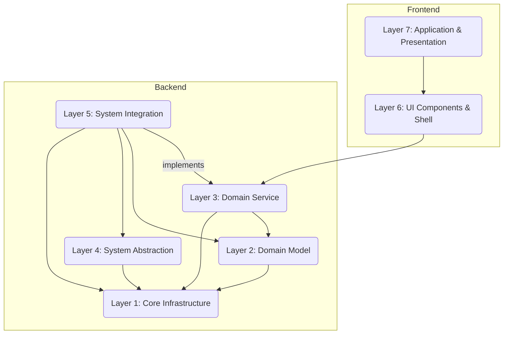

Du musst nacheinander in kleinen chunks die Alten Dokumentationen der 4 Schichten(/Papierkorb) auf die neue 7 Schicht Architektur (Dokumentation) übertragen (Refaktorisieren) und jeweils den übertragenen Teil aus den Alten Dokumenten in "Papierkorb" entfernen.
# AKTUELL Dokumente
Dokumentation/Spezifikation_Schicht_1_Kern-Infrastruktur.md
Dokumentation/Spezifikation_Schicht_2_Domaenen-Modell.md
Dokumentation/Spezifikation_Schicht_3_Domaenen-Service.md
Dokumentation/Spezifikation_Schicht_4_System-Abstraktion.md
Dokumentation/Spezifikation_Schicht_5_System-Integration.md
Dokumentation/Spezifikation_Schicht_6_UI-Komponenten-Shell.md
Dokumentation/Spezifikation_Schicht_7_Anwendungs-Praesentation.md

## ALTE DOKUMENTE
ALLE FOLGENDEN DOKUMENTE MÜSSEN IN DIE NEUE 7 SCHICHT ARCHITEKTUR DOKUMENTE REFAKTORISIERT WERDEN:
Papierkorb/Implementierungsplan.md
Papierkorb/Gesamtspezifikation.md
Papierkorb/NovaSchnittstellen-Implementierungsleitfaden.md
Papierkorb/Model-Context-Protocol.md
Papierkorb/B1 Domänenschicht.md
Papierkorb/C1 System Implementierungsplan.md
Papierkorb/D1 UI-Schicht.md
Papierkorb/ A1 Kernschicht.md
Papierkorb/Entwicklungsplan.md
Papierkorb/Rendering Vulkan.md
Papierkorb/Compositor Smithay Wayland.md
Papierkorb/MCP-UI.md
Papierkorb/AI-MCP-Widgets.md
Papierkorb/Gesamtspezifikationen.md
Papierkorb/Rendering.md
Papierkorb/SPEC-COMPONENT-CORE-CONFIG-v1.0.0: NovaDE Kernschicht Konfigurationsverwaltung.md
Papierkorb/NovaDE Compositor Entwicklungsplan.md
Papierkorb/task_list.md
Papierkorb/SPEC-COMPONENT-CORE-LOGGING-v1.0.0: NovaDE Kernschicht Logging-System.md
Papierkorb/AI-MCP-Interactions.md
Papierkorb/SPEC-COMPONENT-CORE-UTILS-v1.0.0: NovaDE Kernschicht Utilities-Komponente.md
Papierkorb/SPEC-LAYER-SYSTEM-v1.0.0: NovaDE Systemschicht-Spezifikation (Teil 1).md
Papierkorb/Schicht-Schnittstellen.md
Papierkorb/SPEC-COMPONENT-DOMAIN-WORKSPACES-v1.0.0: NovaDE Domänenschicht Arbeitsbereich-Management-Komponente.md
Papierkorb/SPEC-COMPONENT-SYSTEM-WAYLAND-v1.0.0: NovaDE Systemschicht Wayland-Protokoll-Komponente.md
Papierkorb/SPEC-COMPONENT-UI-PANELS-v1.0.0: NovaDE UI-Schicht Panel-Management-Komponente.md
Papierkorb/SPEC-LAYER-CORE-v1.0.0: NovaDE Kernschicht-Spezifikation.md
Papierkorb/MCP-Pflichtenheft.md
Papierkorb/SPEC-COMPONENT-CORE-IPC-v1.0.0: NovaDE Kernschicht Interprozesskommunikations-Komponente.md
Papierkorb/SPEC-COMPONENT-CORE-TYPES-v1.0.0: NovaDE Kernschicht Fundamentale Datentypen-Komponente.md
Papierkorb/NovaDE Compositor Vollständiger Implementierungsplan.md
Papierkorb/SPEC-MODULE-SYSTEM-FILESYSTEM-v1.0.0: NovaDE Dateisystemmanager-Modul (Teil 1).md
Papierkorb/SPEC-MODULE-DOMAIN-NETWORKING-v1.0.0: NovaDE Netzwerkmanager-Modul (Teil 1).md
Papierkorb/SPEC-MODULE-UI-LAUNCHER-v1.0.0: NovaDE Anwendungsstarter-Modul (Teil 1).md
Papierkorb/SPEC-MODULE-DOMAIN-APPLICATION-v1.0.0: NovaDE Anwendungsmanager-Modul (Teil 1).md
Papierkorb/Rendering OpenGL.md
Papierkorb/MCP-Integrate.md
Papierkorb/module_decomposition.md
Papierkorb/SPEC-MODULE-CORE-CONFIG-v1.0.0.md
Papierkorb/SPEC-MODULE-SYSTEM-NOTIFICATION-v1.0.0: NovaDE Benachrichtigungsmanager-Modul (Teil 1).md
Papierkorb/SPEC-MODULE-SYSTEM-WINDOWMANAGER-v1.0.0: NovaDE Fenstermanager-Modul (Teil 1).md
Papierkorb/SPEC-MODULE-DOMAIN-APPLICATION-v1.0.0: NovaDE Anwendungsmanager-Modul (Teil 2).md
Papierkorb/SPEC-MODULE-UI-DESKTOP-v1.0.0: NovaDE Desktop-Modul (Teil 1).md
Papierkorb/SPEC-MODULE-DOMAIN-SETTINGS-v1.0.0: NovaDE Einstellungsmanager-Modul (Teil 1).md
Papierkorb/SPEC-MODULE-CORE-LOGGING-v1.0.0.md
Papierkorb/SPEC-MODULE-SYSTEM-INPUT-v1.0.0: NovaDE Eingabemanager-Modul (Teil 1).md
Papierkorb/SPEC-MODULE-SYSTEM-NOTIFICATION-v1.0.0: NovaDE Benachrichtigungsmanager-Modul (Teil 2).md
Papierkorb/SPEC-MODULE-DOMAIN-NETWORKING-v1.0.0: NovaDE Netzwerkmanager-Modul (Teil 2).md
Papierkorb/SPEC-MODULE-DOMAIN-COMPOSITOR-v1.0.0: NovaDE Compositor-Modul (Teil 1).md
Papierkorb/SPEC-MODULE-DOMAIN-SETTINGS-v1.0.0: NovaDE Einstellungsmanager-Modul (Teil 2).md
Papierkorb/SPEC-MODULE-CORE-ERRORS-v1.0.0.md
Papierkorb/SPEC-MODULE-SYSTEM-INPUT-v1.0.0: NovaDE Eingabemanager-Modul (Teil 2).md
Papierkorb/SPEC-MODULE-UI-LAUNCHER-v1.0.0: NovaDE Anwendungsstarter-Modul (Teil 2).md
Papierkorb/SPEC-MODULE-UI-PANEL-v1.0.0: NovaDE Panel-Modul (Teil 1).md
Papierkorb/SPEC-MODULE-UI-DESKTOP-v1.0.0: NovaDE Desktop-Modul (Teil 2).md
Papierkorb/SPEC-MODULE-DOMAIN-THEMING-v1.0.0: NovaDE Theming-Modul (Teil 1).md
Papierkorb/SPEC-LAYER-UI-v1.0.0: NovaDE Benutzeroberflächenschicht-Spezifikation (Teil 2).md
Papierkorb/SPEC-LAYER-UI-v1.0.0: NovaDE Benutzeroberflächenschicht-Spezifikation (Teil 1).md
Papierkorb/SPEC-LAYER-DOMAIN-v1.0.0: NovaDE Domänenschicht-Spezifikation (Teil 1).md
Papierkorb/SPEC-MODULE-SYSTEM-FILESYSTEM-v1.0.0: NovaDE Dateisystemmanager-Modul (Teil 2).md
Papierkorb/SPEC-MODULE-UI-PANEL-v1.0.0: NovaDE Panel-Modul (Teil 2).md
Papierkorb/SPEC-LAYER-SYSTEM-v1.0.0: NovaDE Systemschicht-Spezifikation (Teil 2).md
Papierkorb/SPEC-LAYER-DOMAIN-v1.0.0: NovaDE Domänenschicht-Spezifikation (Teil 2).md
Papierkorb/SPEC-MODULE-SYSTEM-WINDOWMANAGER-v1.0.0: NovaDE Fenstermanager-Modul (Teil 2).md
Papierkorb/SPEC-MODULE-DOMAIN-COMPOSITOR-v1.0.0: NovaDE Compositor-Modul (Teil 2).md
Papierkorb/Nova Directory.md
Papierkorb/Beschreibung Gesamt.md
Papierkorb/SPEC-MODULE-DOMAIN-THEMING-v1.0.0: NovaDE Theming-Modul (Teil 2).md
Papierkorb/implementation_plan.md
Papierkorb/SPEC-DEPENDENCY-MATRIX-v1.0.0: NovaDE Abhängigkeitsmatrix.md
Papierkorb/SPEC-FEATURE-SYSTEM-HEALTH-DASHBOARD-v0.1.0.md
Papierkorb/project_documentation.md
Papierkorb/NovaDE Spezifikationsentwicklung - Abschlussbericht.md
Papierkorb/NovaDE Mikrofeingranulare Spezifikationsentwicklung - Phase 1 Analyse.md
Papierkorb/Beschreibung Nutzung.md
Papierkorb/SPEC-VALIDATION-RULES-v1.0.0: NovaDE Validierungsregeln.md
Papierkorb/requirements_analysis.md
Papierkorb/SPEC-ROOT-v1.0.0: NovaDE Spezifikationswurzel.md
Papierkorb/NovaDE Spezifikations-Validierung und Konsistenzprüfung.md
Papierkorb/VulkanRendererArchitektur.md
Papierkorb/SPEC-FEATURE-SMART-ASSISTANT-v0.1.0.md
Papierkorb/SPEC-GLOSSARY-v1.0.0: NovaDE Glossar.md
Papierkorb/CONFIGURATION.md
Papierkorb/SYSTEM-HEALTH-MONITORING-AND-DIAGNOSTICS-v1.0.0.md
Papierkorb/Hierarchisches Spezifikationsschema für NovaDE.md
Papierkorb/DEVELOPER_GUIDE.md
Papierkorb/NovaDE Spezifikationsanalyse - Fehlende Komponenten und Unvollständigkeiten.md
Papierkorb/SPEC-CORE-LOGGING-SYSTEM-v1.1.0.md
Papierkorb/NovaDE Spezifikations-Wissensbasis.md
Papierkorb/novade_development_context.md
Papierkorb/Konsistente Namenskonventionen für NovaDE Spezifikationen.md
Papierkorb/Konsistenz- und Vollständigkeitsvalidierung der NovaDE-Spezifikationen.md
Papierkorb/NovaDE Compositor Implementierungsplan - Recherche-Ergebnisse.md
Papierkorb/todo.md

---

# ARCHITEKTUR
## The 7-Layer Architecture: The Unshakable Foundation

NovaDE is built on a strict, non-negotiable 7-layer architecture. Each layer has a distinct responsibility and communicates with others through well-defined interfaces. **No layer may bypass the layer directly above or below it.**

### Layer 1: Core Infrastructure (`novade-core`)

*   **Purpose:** The absolute foundation. Provides project-wide, fundamental tools, types, and utilities.
*   **Responsibilities:**
    *   Defining fundamental data types (geometry, color, typed IDs).
    *   Establishing the central error handling framework (`CoreError`, `ErrorCode`).
    *   Providing system-wide logging (`tracing`) and configuration (`serde`, TOML) infrastructure.
*   **Key Principle:** Has **zero** dependencies on any other NovaDE layer. It is a self-contained library.

### Layer 2: Domain Model (`novade-domain-model`)

*   **Purpose:** The heart of the business logic; the "Nouns" of the system.
*   **Responsibilities:**
    *   Defining the core concepts and data structures of the domain (e.g., `Workspace`, `Theme`, `Notification`).
    *   Enforcing data invariants through rich models (e.g., validation in constructors).
    *   Defining `Repository` traits (e.g., `ThemeRepository`) to abstract persistence.
*   **Key Principle:** Persistence-agnostic and technology-agnostic. Contains no application logic.

### Layer 3: Domain Service (`novade-domain-service`)

*   **Purpose:** The "brain" of the application; the "Verbs" of the system.
*   **Responsibilities:**
    *   Implementing the stateless business logic and use cases (e.g., `ThemingEngine::apply_theme`).
    *   Orchestrating the domain models from Layer 2.
    *   Defining `Service` traits (e.g., `WorkspaceManager`) that act as the primary API for the UI.
    *   Publishing `DomainEvents` (e.g., `ThemeChanged`) after any significant state change.
*   **Key Principle:** Services are stateless. Communication with other systems is done via traits (Dependency Inversion) and events.

### Layer 4: System Abstraction (`novade-system-abstraction`)

*   **Purpose:** The low-level heart of the desktop. The direct interface to the OS kernel and hardware for graphics and input.
*   **Responsibilities:**
    *   Implementing the Wayland compositor (using `smithay`).
    *   Handling all input processing from `libinput` and `udev`.
    *   Managing the rendering pipeline (using `wgpu`/Vulkan).
*   **Key Principle:** Performance and stability are paramount. A crash here is a system crash. It abstracts away all platform-specific details.

### Layer 5: System Integration (`novade-system-integration`)

*   **Purpose:** The "Anti-Corruption-Layer" and diplomatic arm. Connects the pure inner layers to the external world.
*   **Responsibilities:**
    *   **Implementing** the `Repository` traits from Layer 2 (e.g., saving settings to a TOML file).
    *   Communicating with system daemons like UPower or NetworkManager via D-Bus adapters (`zbus`).
    *   Providing the concrete `impl` for the `Service` traits defined in Layer 3.
    *   Implementing the `DomainEventPublisher`.
*   **Key Principle:** Protects the domain model from the messy details of external systems.

### Layer 6: UI Components & Shell (`novade-ui-component-shell`)

*   **Purpose:** The visual foundation and Design System. Provides the reusable UI building blocks.
*   **Responsibilities:**
    *   Implementing a native, high-performance Shell in Rust and **GTK4**.
    *   Providing a comprehensive library of reusable, stateless UI components using **Svelte** and **TypeScript**.
    *   Managing a central theming system that compiles design tokens to CSS for both GTK and the web, ensuring visual consistency.
*   **Key Principle:** A hybrid UI model. The native GTK4 shell acts as a container for WebViews that run the Svelte applications. **Tauri** is the bridge between the two worlds.

### Layer 7: Application & Presentation (`novade-application-presentation`)

*   **Purpose:** The final, visible layer. Assembles components into complete applications.
*   **Responsibilities:**
    *   Composing reusable components from Layer 6 into full applications (e.g., Settings, File Browser).
    *   Implementing the frontend presentation logic (the "Presenter" in an MVP/MVVM pattern).
    *   Managing UI state using reactive Svelte stores.
    *   Defining the `#[tauri::command]` functions that the frontend calls to interact with the backend.
*   **Key Principle:** Strict separation of concerns. This layer contains **no business logic**; it is purely for presentation and calls Layer 3 services for all logical operations.

## 3. Mandatory Technology Stack & Development Guidelines

Adherence to the following technologies and guidelines is non-negotiable to ensure consistency, quality, and architectural purity.

### 3.1. Core Technology Stack

*   **Language (Backend):** Rust (latest stable)
*   **UI (Application Logic):** TypeScript
*   **UI (Components):** Svelte / SvelteKit
*   **UI (Native Shell):** GTK4 & Libadwaita
*   **UI Bridge:** Tauri
*   **Compositor:** Wayland with `smithay`
*   **Input:** `libinput`, `udev`
*   **Graphics:** `wgpu` (Vulkan backend preferred)
*   **IPC/System Services:** D-Bus with `zbus`
*   **Async Runtime:** Tokio
*   **Error Handling:** `thiserror`
*   **Logging:** `tracing`
*   **Serialization:** `serde`
*   **Configuration:** TOML
*   **Build/Environment:** Cargo & Nix

### 3.2. Development Guidelines

*   **Architectural Purity:** The 7-layer architecture is absolute. No layer may be bypassed. No business logic in the frontend. No UI logic in the backend.
*   **Event-Driven:** Communication between decoupled parts of the system should be done via Domain Events, not direct calls. A service in Layer 3 should publish an event, and other components (in Layer 5 or 6) should subscribe and react to it.
*   **Asynchronicity:** All I/O-bound operations (including D-Bus calls and Tauri commands) MUST be `async`. The UI must never be blocked.
*   **Error Handling:** All fallible operations must return a `Result`. Use specific error enums per module/domain, inheriting from a central `CoreError`. Do not use `.unwrap()` or `.expect()` in production code.
*   **Testing:**
    *   Layers 1-3 should have near 100% unit test coverage. Repositories and other dependencies must be mocked.
    *   Layer 5 requires integration tests against real (but temporary/mocked) system services (e.g., a test D-Bus server).
    *   Frontend presentation logic (Presenters) must be unit-tested, mocking the Tauri `invoke` bridge.
*   **Code Style:**
    *   Rust: `rustfmt` is the standard.
    *   TypeScript/Svelte: Adhere to modern best practices (e.g., Prettier).
    *   Comments: Use `// NARRATE:` to explain the "why" behind complex design decisions. Use `///` for all public Rust APIs.
=======
# Dokumente
